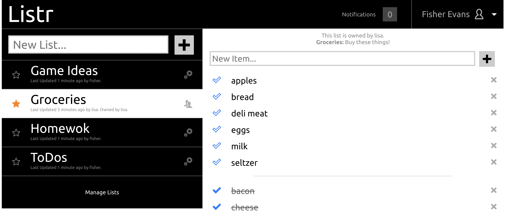

# Listr

Listr was a list making web-app I made for my databases course at VTC during my sophomore year back in 2013. It was one of my very first fully functioning creations - and looking back I'm pretty impressed with my young self. You were able to:

- Register new users (with email validation)
- Login
- Manage your profile
- Create, edit, and archive lists
- Add items to lists (with auto-complete based on past items)
- Add friends
- Share lists
- Get in-app notifcations based on other user activities

It was written in PHP and HTML/CSS/Javascript (using jQuery). It relies on a MySQL database (which was the point of the project).



We won't talk about the lack of tests, abundent security flaws, weird race condition bugs, or shoddy email support.

## Running it Locally

In 2022 I dockerized the project and commented out the email validation in order to run things locally. You should be able to:
```shell
docker-compose up --build
```

And then open up [http://localhost](http://localhost). You'll need to register a user before you can log in. When it prompts you for your email validation code, simply enter `noop`. If you want to reset the database, you can run a:

```shell
docker-compose rm -v db
```

If you want to play around with the database, you can do a

```shell
mysql -h127.0.0.1 -uroot -ppassword
use listr_app;
```